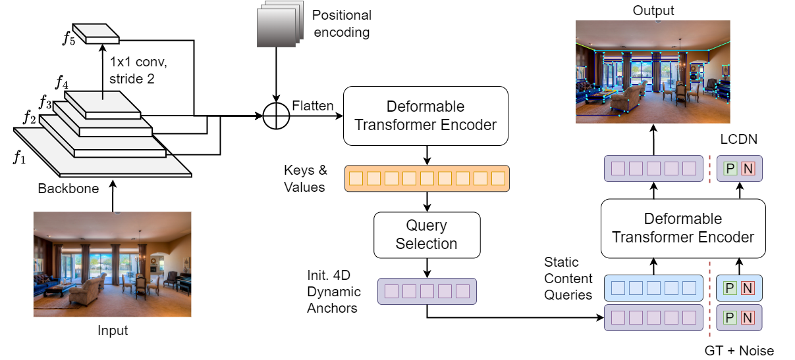
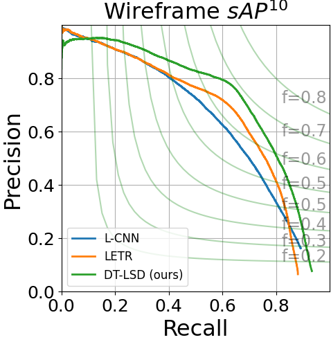
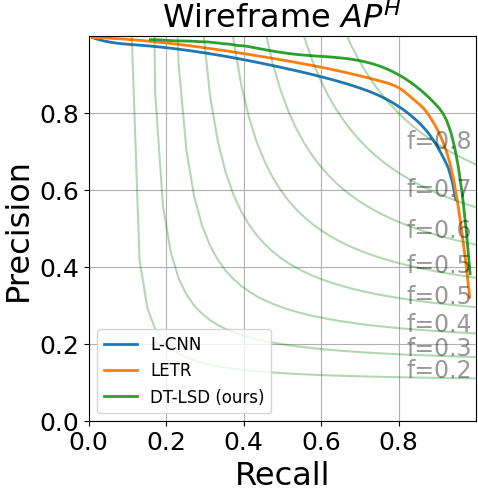
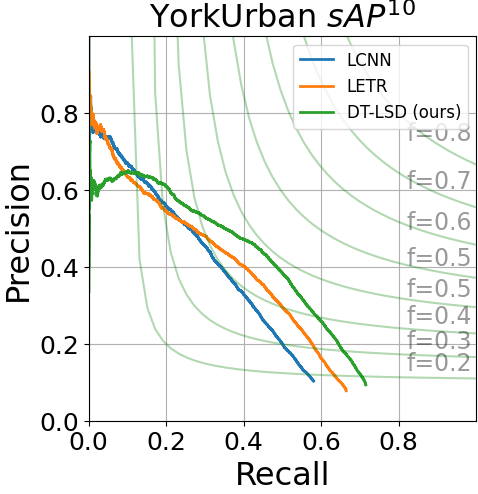
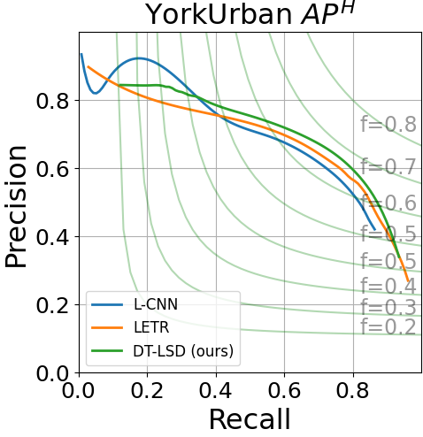

# DT-LSD: Deformable Transformer-based Line Segment Detection
 
This repository contains the official implementation for **DT-LSD** (**D**eformable **T**ransformer-based **L**ine **S**egment **D**etector)



## TODO
<details>
<summary> see details </summary>

- [x] Training
- [x] Evaluation
- [x] Upload source code
- [] Upload weight 
- [] Inference
- [] Upload arxiv paper 
</details>

## Results 
<div align="center">
<p float="left">


</p>
</div>
<div align="center">
<p float="left">


</p>
</div>

|Dataset| sAP10 | sAP15 | APH | FH | FPS
| --- | --- | --- | --- | --- | ---|
|Wireframe| 71.7 | 73.9 | 89.1 | 85.8 | 8.9 |
|YorkUrban| 33.2 | 35.1 | 65.9 | 68.0 | 8.9 |


## Installation


1. Clone this repository.
   ```sh
   git clone https://github.com/SebastianJanampa/DTLSD.git
   cd DTLSD
   ```

2. Install Pytorch and torchvision

   Follow the instruction on https://pytorch.org/get-started/locally/.
   ```sh
   # an example:
   conda install -c pytorch pytorch torchvision
   ```

3. Install other needed packages
   ```sh
   pip install -r requirements.txt
   ```
      
4. Compiling CUDA operators
   ```sh
   cd models/dtlsd/ops
   python setup.py build install
   # unit test (should see all checking is True)
   python test.py
   cd ../../..
   ```

## Dataset

To reproduce our results, you need to process two datasets, [ShanghaiTech](https://github.com/huangkuns/wireframe) and [YorkUrban](https://www.elderlab.yorku.ca/resources/york-urban-line-segment-database-information/). Files located at ./helper/wireframe.py and ./helper/york.py are both modified based on the code from [L-CNN](https://github.com/zhou13/lcnn), which process the raw data from download.

- ShanghaiTech Train Data
    - To Download (modified based on from [L-CNN](https://github.com/zhou13/lcnn))
        ```bash
        cd data
        bash ../helper/gdrive-download.sh 1BRkqyi5CKPQF6IYzj_dQxZFQl0OwbzOf wireframe_raw.tar.xz
        tar xf wireframe_raw.tar.xz
        rm wireframe_raw.tar.xz
        python ../helper/wireframe.py ./wireframe_raw ./wireframe_processed

        ```
- YorkUrban Train Data
    - To Download  
        ```bash
        cd data
        wget https://www.dropbox.com/sh/qgsh2audfi8aajd/AAAQrKM0wLe_LepwlC1rzFMxa/YorkUrbanDB.zip
        unzip YorkUrbanDB.zip 
        python ../helper/york.py ./YorkUrbanDB ./york_processed
        
        ```
- Processed Evaluation Data
    ```bash
    bash ./helper/gdrive-download.sh 1T4_6Nb5r4yAXre3lf-zpmp3RbmyP1t9q ./evaluation/data/wireframe.tar.xz
    bash ./helper/gdrive-download.sh 1ijOXv0Xw1IaNDtp1uBJt5Xb3mMj99Iw2 ./evaluation/data/york.tar.xz
    tar -vxf ./evaluation/data/wireframe.tar.xz -C ./evaluation/data/.
    tar -vxf ./evaluation/data/york.tar.xz -C ./evaluation/data/.
    rm ./evaluation/data/wireframe.tar.xz
    rm ./evaluation/data/york.tar.
    
## Pretraining weights
Download the weights from DINO_SWIN_4scales_36_epochs from the [DINO repo](https://github.com/IDEA-Research/DINO/tree/main), and place it on the pretrain folder.
 
## Run

1. Training
```sh
bash scripts/train/DTLSD_SWIN_4_scales_24_epochs.sh 
```

2. Testing
```sh
bash scripts/train/DTLSD_SWIN_4_scales_24_epochs.sh
```

